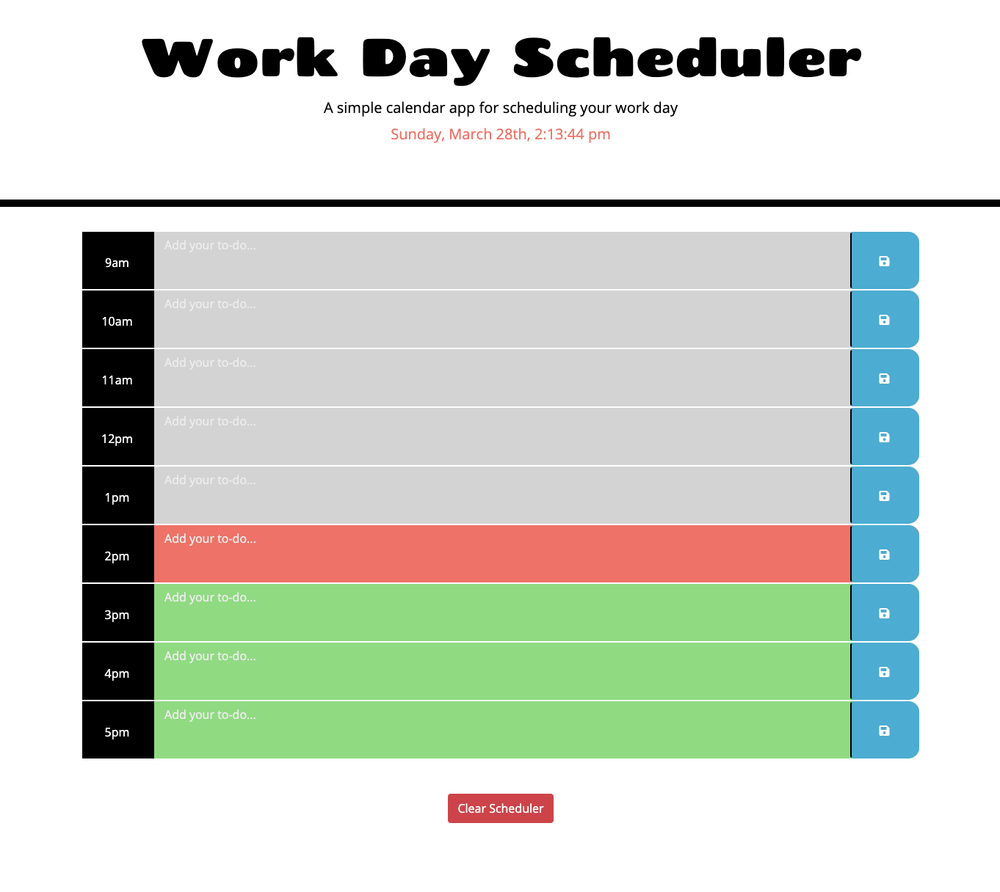

# Work Day Scheduler

## Links
### Link to the GitHub page is [here](https://michellewatts20000.github.io/work-day-scheduler/)
### Link to the GitHub repo is [here](https://github.com/michellewatts20000/work-day-scheduler)

## Technologies used
HTML, JavaScript, CSS, Bootstrap, JQuery, FontAwesome and Moment.

## What the app does
Enter your workday schedule into this app. Once you have entered your task into the text field and click the save button your task will be saved to local storage.

You will be notified that your task has been saved to local storage with a pop up. If you want to reset the scheduler click the clear scheduler button at the bottom.

If the time is in the past the row will go grey. If the time is in the present the row will be red. Rows with future times will appear green. The app will check if colours are still correct every minute.

The timer at the top tells you the current date and time and updates every second.

  ## Screenshot

## Contact
Michelle Watts
watts.e.michelle@gmail.com

